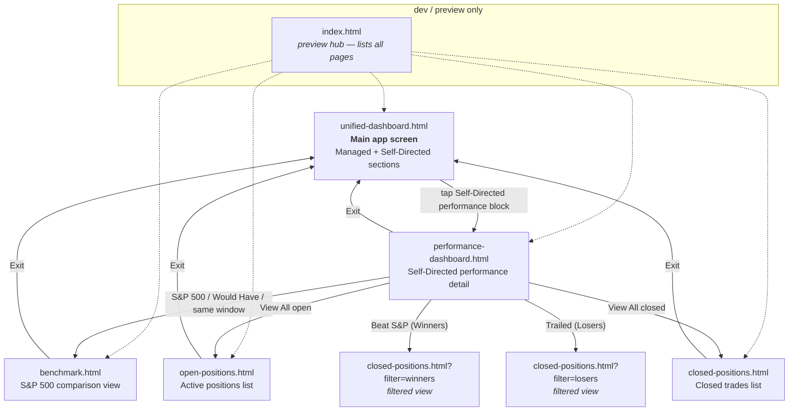

# Page Flow

How the six prototype screens connect.

**Tip:** For an interactive visual version, open [`flow.html`](./flow.html) — all six pages laid out as live miniatures with arrows between them.

## Mermaid diagram

## Plain-language summary

**Entry point (production):** `unified-dashboard.html` — this is what a user opens. Two top-level sections (Managed, Self-Directed) with portfolio summaries.

**Drill-down from Unified Dashboard:**
- Tap the Self-Directed performance block → `performance-dashboard.html`

**`performance-dashboard.html` is the hub for detail screens.** From here a user can navigate to:
- `benchmark.html` — three different entry points (S&P 500 label, "S&P Would Have" link, "same window" label)
- `open-positions.html` — via "View All" on the active positions block
- `closed-positions.html` — via "View All" on the closed trades block
- `closed-positions.html?filter=winners` — via "Beat S&P (Winners)" link
- `closed-positions.html?filter=losers` — via "Trailed (Losers)" link

**Exit pattern:** every drill-down screen (`performance-dashboard`, `benchmark`, `open-positions`, `closed-positions`) has an "Exit" button in the top-right that returns to `unified-dashboard.html`.

**`index.html`** is a developer/preview hub, not a production screen — it lists all five real screens so they can be opened individually during review. It would not ship.

## Query-string variants

Only `closed-positions.html` accepts a query string in the current prototype:

| URL | Behavior expected |
|---|---|
| `closed-positions.html` | Full list, no filter |
| `closed-positions.html?filter=winners` | Filter to trades that beat S&P 500 |
| `closed-positions.html?filter=losers` | Filter to trades that trailed S&P 500 |

The prototype's JS reads `URLSearchParams` on load (see `closed-positions.js`).

## Backward navigation

Every screen except `unified-dashboard.html` and `index.html` includes a back button (`<a href="javascript:history.back()">`) in the top-left, in addition to the "Exit" link in the top-right.

## Engineering notes from the flow

1. **`unified-dashboard.html` is the single return target.** Five different screens all exit to it — confirm this matches the production navigation model (e.g., is it always a hard navigation, or should some be a modal close?).
2. **`benchmark.html` has three different entry points from `performance-dashboard.html`.** All three should land on the same content; engineering can decide whether to pass context (e.g., which metric was tapped) via query string.
3. **`closed-positions.html` filter is the only stateful URL** in the prototype — wire other filter screens the same way if they're added.
4. **No state is shared across pages** in the prototype. Each page renders standalone from hardcoded data. The production version will need a shared data layer.
